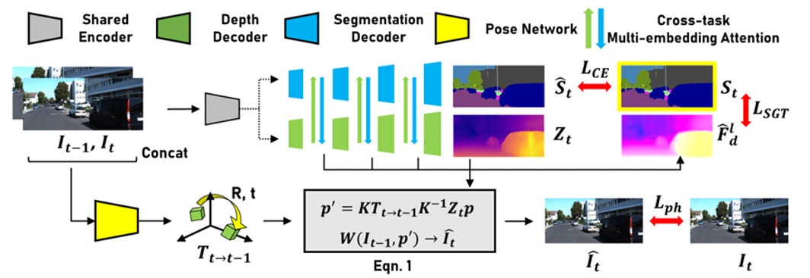

# FSRE reproduction


This repository is the official implementation of Fine-grained Semantics-aware Representation Enhancement (https://arxiv.org/pdf/2108.08829.pdf). 



## Requirements

📋  To install requirements:

```setup
pip install -r requirements.txt
```


## Training

📋 To train the models in the paper, run this command:

```train
VISIBLE_DEVICES=0 python -m  trainer --data_path /Datasets/monodepth_benchmark/kitti_raw_sync/

```


## Evaluation

📋 To evaluate my model on Kitti eigen split, run:

```eval
python export_gt_depth.py --data_path /Datasets/monodepth_benchmark/kitti_raw_sync/  --split eigen

python evaluate_depth.py --load_weights_folder weights/ --data_path /Datasets/monodepth_benchmark/kitti_raw_sync/ 

```


## Trained Models

You can download the model trained on kitti_raw_sync for 25 epochs:

- [Trained model](https://drive.google.com/file/d/1UFRBeWo4pRTO-rTFnfopNsXTNuwInQNu/view?usp=share_link).


## Results

Our model achieves the following performance on KITTI eigen split:

|                          |  RMS   |  RMSlog  |
|   :-----------------     | :----- |  :-----  |
|  Original paper results  |  4.547 |  0.182   |
|       Our results        |  4.536 |  0.183   |

Examples of estimated depth maps are presented in this demonstration.


